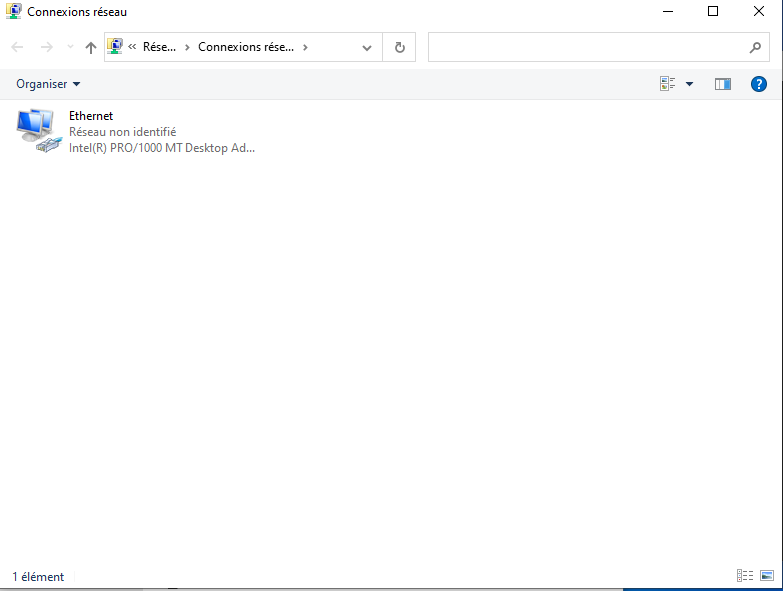
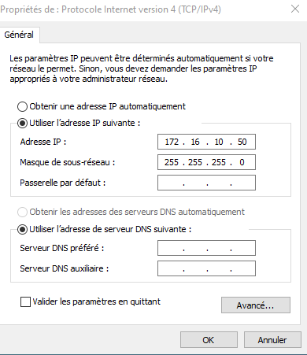
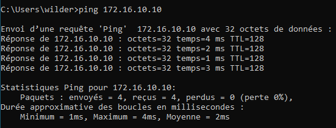

## Question 1.1 - Pourquoi le ping avec les adresses IP des machines ne fonctionnent pas ? Modifie la configuration sur le client pour que cela soit possible. Explique ce que tu as fait et montre le par des copies d'écran. On doit avoir la copie d'écran d'un ping fonctionnel.

Les appareils n'appartiennent pas au même réseau. Ayant tous deux le même masque, les trois premiers octects 
définissant donc le réseau se doivent d'être équivalent pour qu'un ping soit réalisable. 
Client -> 172.16.100.50   255.255.255.0
Serveur -> 172.16.10.10	  255.255.255.0

Il faut donc se rendre dans les paramètres réseaux de la VM client (screen 1.1), cliquez sur "Propriétés" concernant 
l'IPv4, et modifiez le troisième de l'octet pour qu'il soit équivalent à celui du server (screen1.2).
Screen1.3

## Question 1.2 - Le ping avec le nom des machines ne fonctionne pas. Modifie la configuration sur le client et/ou le serveur pour que cela soit possible et qu'un ping entre les 2 machines fonctionne avec le nom. Explique ce que tu as fait et montre le par des copies d'écran. On doit avoir la copie d'écran d'un ping fonctionnel.

Rendez-vous sur la VM server et allez dans "Outils"-> "DHCP". Ensuite, effectuer un clique droit sur "Reverse lookup zone" pour pouvoir ping non pas, par l'adresse IP, mais par le nom (screen2.1). Choisissez "New zone" -> "Primary" -> "IPv4", définissez le réseau sur lequel appliquer la recherche, puis cliquez sur "reverse lookup name".
Une fois cela fait, cliquez droit sur "SWEETCAKES" et choisisseez "New Host A" (Screen2.2). Renseignez le nom ( ici CLIWIN10 ) et son ip ( 172.16.10.50 ) et validez.
Vous pouvez maintenant ping le client par son nom (screen2.3). 

## Question 1.3 - Modifie la configuration réseau du client pour qu'il soit en DHCP. Vérifie le paramétrage DHCP sur le serveur et compare le avec l'adresse IP du client. Explique pourquoi le client ne récupère pas la 1ère adresse disponible sur la plage DHCP du serveur ? Fais une copie d'écran montrant l'adresse IP prise par le client.

Après avoir modifié en DHCP l'attribution IP du poste client, effectuer la commande ipconfig attribue l'IP suivante : 172.16.10.20 . (screen3.1)
La raison a cela est que dans la plage adresse définie sur le server, les adresses 172.16.10.1 à 172.16.10.19 sont exclues (screen3.2). Donc naturellement, le client récupère la 
prmeière adresse IP disponible sur le site, à savoir la .20 . 

## Question 1.4 - Est-ce que ce client peut avoir l'adresse IP 172.16.10.15 en DHCP ? Si oui fais les manipulations nécessaires. Explique ce que tu as fait et montre par une copie d'écran le résultat de la commande ipconfig /all sur le client.

Il est possible que le client ait une adresse en 172.16.10.15 en DHCP. Pour cela, il faut effectuer une réservation d'adresse. Une fois sur l'onglet gestion du DHCP, cliquez sur "IPv4" -> "Scope" -> "Réservation". Renseignez enuite le nom de la réservation, l'adresse IP a attribuée, l'adresse MAC de l'apapreil, ainsi que sa description (screen4.1).

Une fois validée, effectuer rendez-vous sur l'invite de commande du client et saisissez la commande
"ipconfig /release" puis "ipconfig /renew" pour respectivmeent libérer le bail et immédiatement 
en attribuer un nouveau ( soit une IP ). Enfin la commande "ipconfig /all" affiche la nouvelle 
adresse désirée, rentrée préalablement en réservation (screen4.2).

